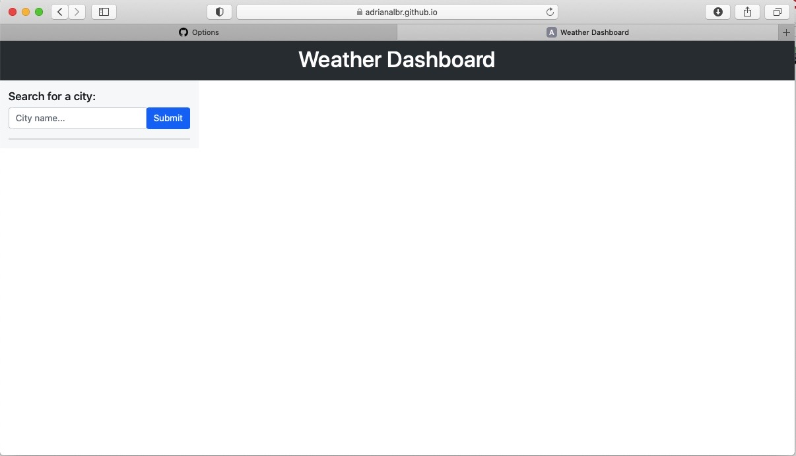
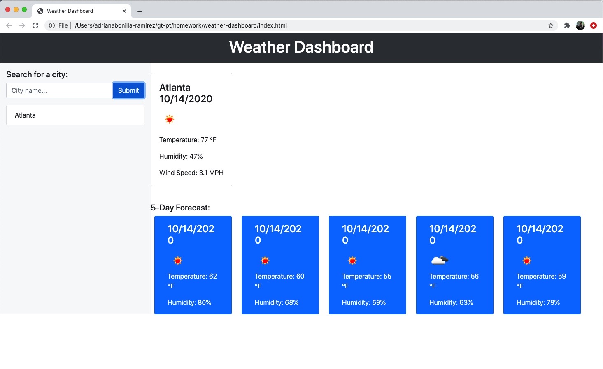
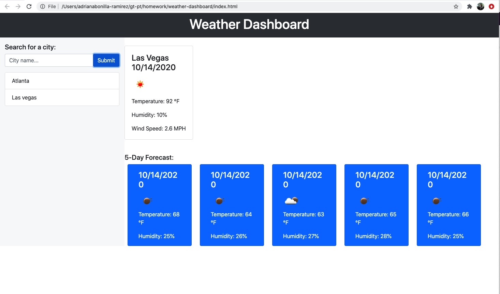
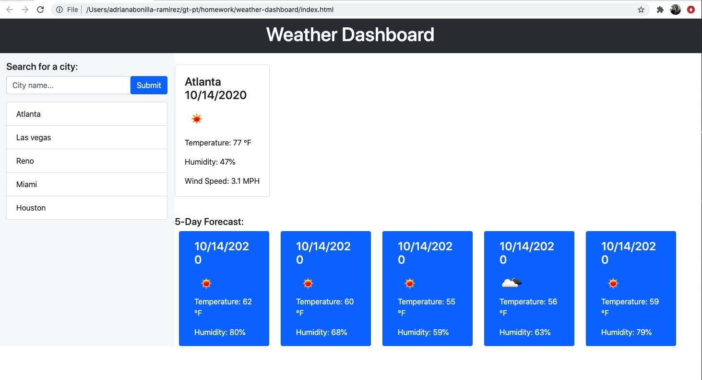

# Weather-dashboard

## Objective

The objective of this application is to create a weather dashboard that allows the user to type a city and get the current weather conditions for the day as well as the 5 day forecast. The application adds the city to the search history.
When the user clicks on cities saved in the history the weather for those cities is displayed.

For this application we use the [OpenWeather API](https://openweathermap.org/api) to retrieve weather data for cities.

## Development Phase
- Obtain API Key
- Test API and ensure that we can pull all date
- Create layout
- Develop ajax call
- Develop dynamic elements
- Style
- Develop local storage
- Develop call back for history cities

## Testing Phase
- Test layout and formatting
- Test API with different cities and conditions
- Test history list
- Test local storage
- End to end testing and debugging

## Deployment Phase

The application can be found here - https://adrianalbr.github.io/weather-dashboard/

## How it works

The user is presented with a form to enter the city and a submit button

The user submits a city and the day forecast and five day forecast is presented, and the city is added to the history list

If the user wants to search for another city they can enter it in the search, and the new forecast will be displayed and the new city will be added to the history list

The user can also click back to cities in the history and the weather will be displayed

Enjoy!
- - -
© 2020 Adriana Bonilla-Ramirez. All Rights Reserved.
